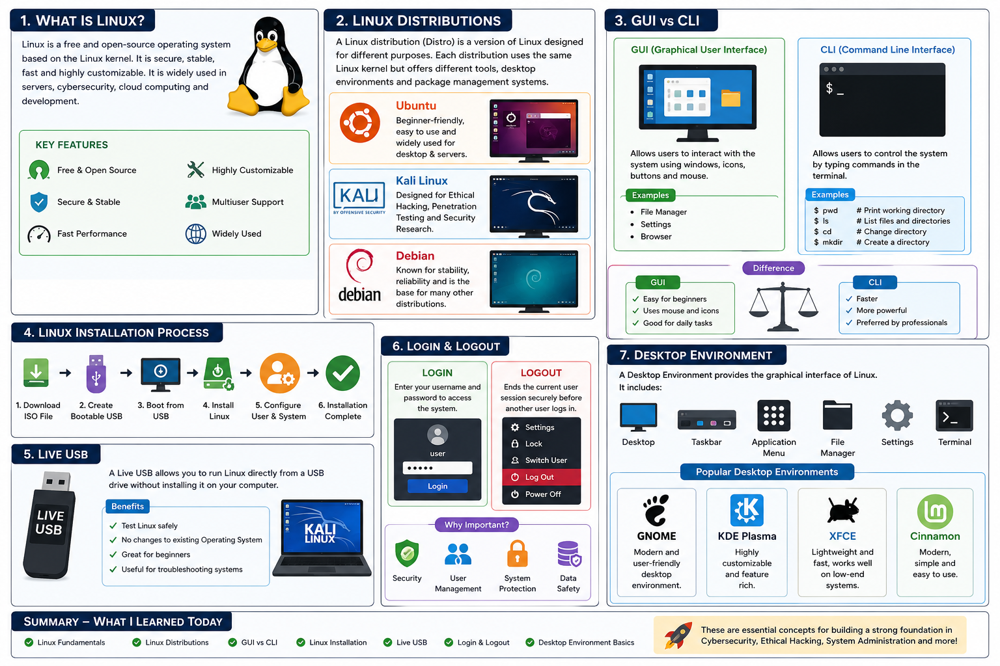

# 🚀 Day 1 – Linux Fundamentals & Cybersecurity Journey

Welcome to **Day 1** of my Linux & Cybersecurity learning journey.

Today, I learned the basic concepts of Linux, which is one of the most important operating systems in **Cybersecurity, Ethical Hacking, System Administration, Cloud Computing, and DevOps**.

---

# 📚 Topics Covered

## 1️⃣ What is Linux?

Linux is a **free and open-source operating system**. Unlike Windows, anyone can view, modify, and improve its source code.

Because of its **security, stability, and flexibility**, Linux is widely used in:

- Cybersecurity
- Ethical Hacking
- Cloud Computing
- Software Development
- Servers
- DevOps

### Key Features

- ✅ Free & Open Source
- ✅ Secure & Stable
- ✅ Fast Performance
- ✅ Highly Customizable
- ✅ Preferred by Developers & Security Professionals

---

## 2️⃣ Linux Distributions

A **Linux Distribution (Distro)** is a version of Linux designed for different purposes.

### Popular Linux Distributions

| Distribution | Purpose |
|--------------|---------|
| Ubuntu | Beginner Friendly |
| Kali Linux | Ethical Hacking & Penetration Testing |
| Debian | Stability & Reliability |

All Linux distributions use the **Linux Kernel**, but they provide different:

- Desktop Environments
- Software Packages
- Package Managers
- Default Applications

---

## 3️⃣ GUI vs CLI

### GUI (Graphical User Interface)

GUI allows users to interact using:

- Windows
- Icons
- Buttons
- Mouse

Examples:

- File Manager
- Settings
- Web Browser

---

### CLI (Command Line Interface)

CLI allows users to interact with Linux by typing commands in the terminal.

Examples:

```bash
pwd
ls
cd
mkdir
```

### Difference

| GUI | CLI |
|-----|-----|
| Easy for beginners | Faster and more powerful |
| Uses mouse and icons | Uses commands |
| User-friendly | Preferred by Linux Admins & Cybersecurity Professionals |

---

## 4️⃣ Linux Installation Process

Basic Linux installation steps:

1. Download the Linux ISO
2. Create a Bootable USB
3. Boot from USB
4. Install Linux
5. Configure Username & Password
6. Complete System Setup

Learning installation helps in setting up Linux for practice and professional work.

---

## 5️⃣ Live USB

A **Live USB** allows you to run Linux directly from a USB drive without installing it on your computer.

### Benefits

- ✅ Test Linux safely
- ✅ No changes to existing OS
- ✅ Beginner Friendly
- ✅ Useful for troubleshooting

---

## 6️⃣ Login & Logout

### Login

Enter your **username** and **password** to access the system securely.

### Logout

Ends the current user session securely before another user logs in.

This is an important concept in **Linux User Management** and **System Security**.

---

## 7️⃣ Desktop Environment

A **Desktop Environment (DE)** provides the graphical interface of Linux.

It includes:

- Desktop
- Taskbar
- Application Menu
- File Manager
- Settings
- Terminal

### Popular Desktop Environments

- GNOME
- KDE Plasma
- XFCE
- Cinnamon

---

# 🎯 What I Learned Today

By the end of Day 1, I gained a strong understanding of:

- ✅ Linux Fundamentals
- ✅ Linux Distributions
- ✅ GUI vs CLI
- ✅ Linux Installation
- ✅ Live USB
- ✅ Login & Logout
- ✅ Desktop Environment

These concepts form the foundation for learning:

- Cybersecurity
- Ethical Hacking
- System Administration
- DevOps
- Cloud Computing

## 🖼️ Linux Fundamental Diagram



---

# 🚀 Learning Goal

I am committed to learning Linux and Cybersecurity every day by documenting my progress and building practical skills through hands-on practice.

Stay tuned for **Day 2**!

---

## ⭐ Connect With Me

If you're also learning Linux or Cybersecurity, feel free to explore this repository, share feedback, or connect with me.


## 🌐 Connect With Me
🔗 LinkedIn: [My LinkedIn Profile](https://www.linkedin.com/in/talhanoor-cybersecurity/)

---

### 📌 Repository Tags

`Linux` `Cybersecurity` `Ethical-Hacking` `Ubuntu` `Kali-Linux` `Debian` `DevOps` `Cloud-Computing` `Linux-Basics` `Open-Source` `Learning-Journey`
