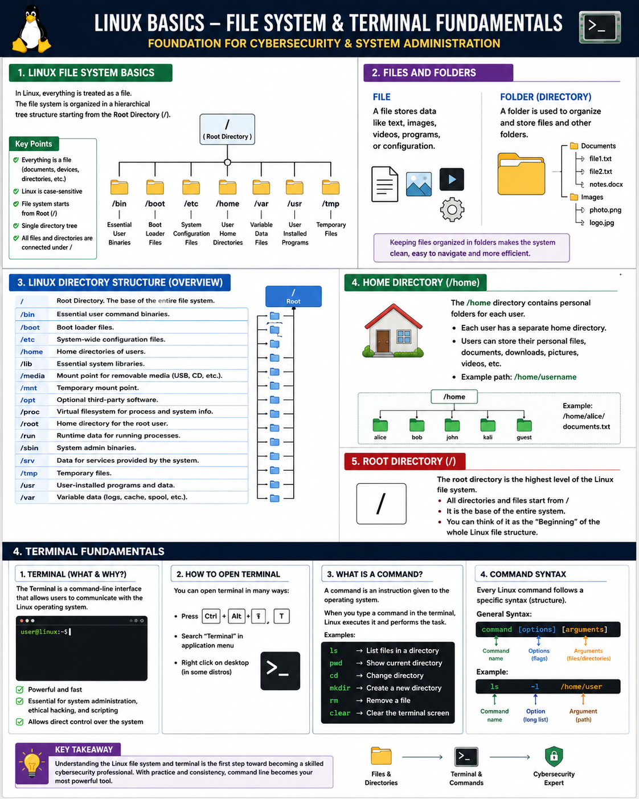

# 🚀 Day 2 – Linux File System & Terminal Fundamentals

Welcome to **Day 2** of my Linux & Cybersecurity learning journey.

Today, I continued learning the fundamentals of Linux. Before diving into Ethical Hacking, Penetration Testing, System Administration, Cloud Computing, or DevOps, it's important to understand how Linux works internally. Building a strong foundation makes advanced topics much easier to learn later.

---

# 📚 Topics Covered

## 📂 1️⃣ Linux File System Basics

I learned that **everything in Linux is treated as a file**. Documents, images, videos, folders, hardware devices, and even many system resources are managed through the Linux file system.

The Linux file system is organized in a structured hierarchy, making it easier to manage data efficiently. Understanding how files and directories are connected is one of the first steps toward becoming comfortable with Linux.

### 🔑 Key Points

- Everything is treated as a file.
- Organized using a hierarchical structure.
- Makes file management simple and efficient.
- Essential knowledge for Linux administration and cybersecurity.

---

## 📁 2️⃣ Files and Folders

I learned the difference between **files** and **folders (directories)**.

- **File:** Stores information such as text, images, videos, programs, or configuration data.
- **Folder (Directory):** Used to organize and store files as well as other directories.

Keeping files organized inside directories makes the system cleaner, easier to navigate, and more efficient.

---

## 🗂️ 3️⃣ Linux Directory Structure

Linux follows a **hierarchical directory structure** that starts from a single top-level directory.

Unlike Windows, which uses drive letters like **C:** or **D:**, Linux stores everything under one directory tree. Every directory has a specific purpose, helping keep the operating system organized and secure.

Learning the directory structure helped me understand where user files, system files, and application files are stored.

---

## 🏠 4️⃣ Home Directory (/home)

The **Home Directory** is the personal workspace for every user.

This is where personal files, documents, downloads, pictures, videos, and user-specific configuration files are stored. Every user has a separate home directory, keeping personal data organized and protected.

---

## 🌳 5️⃣ Root Directory (/)

The **Root Directory (`/`)** is the highest level of the Linux file system.

Every file and folder in Linux begins from this directory. It serves as the foundation of the entire operating system, and all other directories exist beneath it.

Understanding the root directory helped me visualize how the Linux file system is structured.

---

## 💻 6️⃣ Terminal Fundamentals

One of the most exciting topics I learned today was the **Linux Terminal**.

The terminal is a **Command-Line Interface (CLI)** that allows users to communicate directly with the operating system. Instead of clicking buttons, users type commands to perform different tasks.

The terminal is one of the most powerful tools in Linux and is widely used by:

- System Administrators
- Developers
- DevOps Engineers
- Cloud Engineers
- Cybersecurity Professionals
- Ethical Hackers

---

## ⌨️ 7️⃣ How to Open the Terminal

I learned different ways to open the Linux terminal, including:

- Using keyboard shortcuts
- Opening it from the Applications Menu
- Launching it through desktop search

Getting comfortable with opening and using the terminal is the first practical step toward mastering Linux.

---

## 🖥️ 8️⃣ What is a Command?

A **command** is an instruction given to the operating system.

When a user enters a command in the terminal, Linux processes the instruction and performs the requested task, such as:

- Displaying files
- Creating folders
- Moving files
- Deleting data
- Viewing system information

Commands are the primary language used to communicate with Linux.

---

## ⚙️ 9️⃣ Understanding Command Syntax

I also learned that every Linux command follows a specific structure.

### Basic Syntax

```text
command [options] [arguments]
```

### Components

- **Command** → The program or instruction to execute.
- **Options (Flags)** → Modify the command's behavior.
- **Arguments** → Specify files, directories, or other input.

Learning command syntax is important because even a small mistake can change the outcome of a command.

---

# 💡 What I Learned Today

Today's learning gave me a much better understanding of how Linux organizes files and how users interact with the operating system through the terminal.

Rather than memorizing commands, I'm focusing on understanding the concepts behind them so I can build a strong and lasting foundation.

Every expert starts with the basics, and I'm committed to learning one step at a time.


## 🖼️Linux File System Terminal Diagram



---

# 🎯 Next Goal

On **Day 3**, I will begin learning basic Linux commands and practice navigating the Linux file system using the terminal.


## 🌐 Connect With Me
🔗 LinkedIn: [My LinkedIn Profile](https://www.linkedin.com/in/talhanoor-cybersecurity/)

---

## 📌 Summary

Today I learned:

- Linux File System Basics
- Files vs Folders
- Linux Directory Structure
- Home Directory (`/home`)
- Root Directory (`/`)
- Terminal Fundamentals
- How to Open the Terminal
- What is a Command?
- Command Syntax

---

> *"Strong fundamentals are the foundation of every cybersecurity professional."*

---

# 🏷️ Tags

`#Linux` `#CyberSecurity` `#EthicalHacking` `#LinuxLearning` `#OpenSource` `#CommandLine` `#Terminal` `#SystemAdministration` `#CloudComputing` `#Networking` `#LearningInPublic` `#InformationSecurity` `#FutureCybersecurityProfessional`
