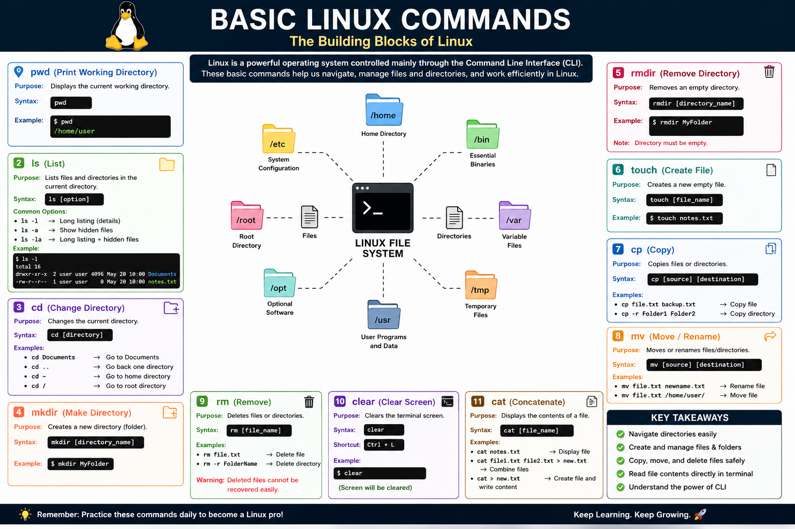

# 🚀 Day 3 – Basic Linux Commands

## 📖 Introduction

Today, I learned the basic Linux commands used in the Command Line Interface (CLI). These commands are essential for navigating directories, creating and managing files, organizing folders, and working efficiently in Linux.

Learning these commands builds a strong foundation for Cybersecurity, Ethical Hacking, System Administration, DevOps, and Cloud Computing.

---

# 📚 Commands Covered

## 1. `pwd` – Print Working Directory

Shows the current working directory.

```bash
pwd
```

Example Output:

```text
/home/talha
```

---

## 2. `ls` – List Files and Directories

Lists files and folders in the current directory.

```bash
ls
```

Useful options:

```bash
ls -l
```

Detailed list.

```bash
ls -a
```

Show hidden files.

```bash
ls -la
```

Detailed list including hidden files.

---

## 3. `cd` – Change Directory

Move between directories.

```bash
cd Documents
```

Go back one directory:

```bash
cd ..
```

Go to the home directory:

```bash
cd ~
```

Go to the root directory:

```bash
cd /
```

---

## 4. `mkdir` – Create Directory

Create a new folder.

```bash
mkdir LinuxPractice
```

---

## 5. `rmdir` – Remove Empty Directory

Delete an empty folder.

```bash
rmdir LinuxPractice
```

> **Note:** Works only for empty directories.

---

## 6. `touch` – Create File

Create an empty file.

```bash
touch notes.txt
```

---

## 7. `cp` – Copy Files or Directories

Copy a file:

```bash
cp notes.txt backup.txt
```

Copy a directory:

```bash
cp -r Folder1 Folder2
```

---

## 8. `mv` – Move or Rename Files

Rename a file:

```bash
mv notes.txt linux_notes.txt
```

Move a file:

```bash
mv linux_notes.txt Documents/
```

---

## 9. `rm` – Remove Files or Directories

Delete a file:

```bash
rm notes.txt
```

Delete a directory:

```bash
rm -r FolderName
```

> ⚠️ **Warning:** Deleted files are difficult to recover.

---

## 10. `clear` – Clear Terminal

Clear the terminal screen.

```bash
clear
```

Shortcut:

```text
Ctrl + L
```

---

## 11. `cat` – Display File Contents

View the contents of a file.

```bash
cat notes.txt
```

---

# 🧠 What I Learned

- Navigated directories using the terminal.
- Created and managed files and folders.
- Copied and moved files.
- Deleted files and directories safely.
- Displayed file contents using `cat`.
- Improved confidence using the Linux CLI.

---

# 📌 Commands Summary

| Command | Description |
|---------|-------------|
| `pwd` | Show current directory |
| `ls` | List files and folders |
| `cd` | Change directory |
| `mkdir` | Create directory |
| `rmdir` | Remove empty directory |
| `touch` | Create file |
| `cp` | Copy files/directories |
| `mv` | Move or rename files |
| `rm` | Remove files/directories |
| `clear` | Clear terminal |
| `cat` | Display file contents |

---

# 🎯 Key Takeaways

- Learned essential Linux commands.
- Understood Linux directory navigation.
- Practiced file and folder management.
- Built a strong foundation for Linux and Cybersecurity.
- Improved confidence in using the Linux terminal.

## 🖼️ Basic Linux Commands


---

# 🚀 Conclusion

Basic Linux commands are the foundation of working with Linux systems. These commands are used daily by System Administrators, DevOps Engineers, Cloud Engineers, Cybersecurity Professionals, and Ethical Hackers.

I will continue practicing these commands to improve my speed, accuracy, and confidence while using Linux.

## 🌐 Connect With Me
🔗 LinkedIn: [My LinkedIn Profile](https://www.linkedin.com/in/talhanoor-cybersecurity/)

---

### 📌 Repository Tags

`Linux` `Linux Commands` `CLI` `Terminal` `Ubuntu` `Bash` `Shell` `File System` `Beginner` `Cybersecurity` `Ethical Hacking` `System Administration` `DevOps` `Cloud Computing` `Linux Learning` `GitHub`

⭐ **Thank you for visiting my Linux learning journey!**
